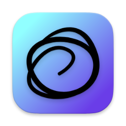

# MultiTimeInMenuBar

<div align="center">
   <br />
  
</div>


MultiTimeInMenuBar allows you to add clocks of your favorite cities across the world in your menu bar, along with the country flag. 

## Download

### Latest Release
Download the latest version from the [Releases page](https://github.com/rshin/MultiTimeInMenuBar/releases/latest). The app is distributed as a signed and notarized DMG file.

### Installation
1. Download the DMG file from the releases page
2. Open the DMG and drag MultiTimeInMenuBar.app to your Applications folder
3. Launch the app from Applications or Spotlight

### Requirements
- macOS 15.4 or later

## Development

This project uses GitHub Actions for automated building, signing, and distribution. See [GITHUB_ACTIONS_SETUP.md](GITHUB_ACTIONS_SETUP.md) for setup instructions.

### Building Locally
```bash
xcodebuild -project MultiTimeInMenuBar.xcodeproj -scheme MultiTimeInMenuBar -configuration Release build
```

## Features

- Display multiple timezone clocks in your menu bar
- Easy city selection and timezone management
- Lightweight and efficient menu bar app

## Known Limitations
macOS will hide items in the menu bar if you run out of screen space. If you lose your clock, you can find it back by temporarily removing some items from your Control Center menu bar by going to Settings > Control Center and setting temporarily setting some items to "Don't Show in Menu Bar". Then you can pick and choose what's important to you.